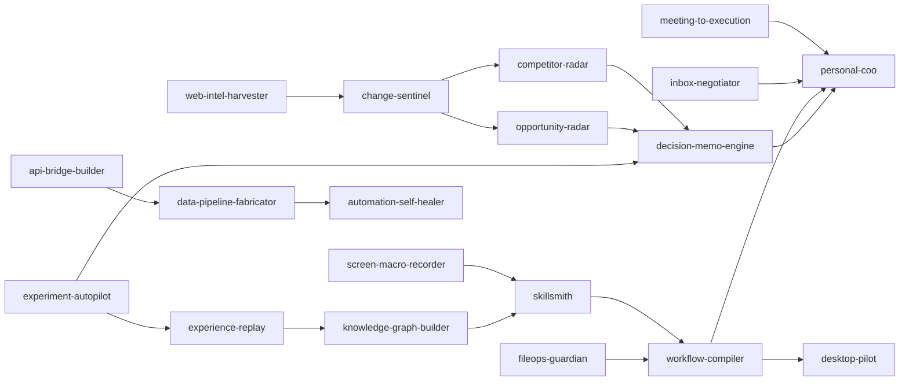

# Architecture

## Goal

The pack separates reusable workflow instructions from host capabilities and private user context. It should be possible to inspect every skill, understand why it might trigger, see which permissions it expects, and test whether its written boundary is coherent.

## Components

```text
.codex-plugin/plugin.json
        │
        ├── skills/<name>/SKILL.md
        │       ├── agents/openai.yaml
        │       └── examples.md
        │
        ├── catalog/skills.json
        ├── catalog/routes.json
        │
        ├── deterministic router + evaluator
        ├── structural validator
        ├── preview-first installer
        │
        └── CI / public audit / release gates
```

The host consumes `SKILL.md`. The repository tooling consumes the machine-readable catalogs. Tests require both representations to agree.

## Four layers

### Layer 1 — Intelligence

- `web-intel-harvester`
- `change-sentinel`
- `competitor-radar`
- `opportunity-radar`

This layer collects and structures evidence. It should not silently become a recommendation engine.

### Layer 2 — Engineering & Execution

- `screen-macro-recorder`
- `desktop-pilot`
- `api-bridge-builder`
- `data-pipeline-fabricator`
- `fileops-guardian`
- `workflow-compiler`
- `automation-self-healer`

The layer contains consequential capabilities, so most members are explicit-only or carry separate write approvals.

### Layer 3 — Decision & Learning

- `decision-memo-engine`
- `experiment-autopilot`
- `knowledge-graph-builder`
- `skillsmith`
- `experience-replay`

This layer converts evidence and experience into decisions, tests, reusable knowledge, and refined workflows.

### Layer 4 — Orchestration & Operations

- `mission-control`
- `meeting-to-execution`
- `inbox-negotiator`
- `personal-coo`

`mission-control` owns multi-skill routing only after explicit invocation. `personal-coo` coordinates only explicitly selected commitments and never creates a hidden personal profile.

## Advisory graph



No edge performs an action. It only states when the next skill may be considered. Every target independently rechecks activation, scope, capability, and approval.

## Source hierarchy

1. `catalog/skills.json` — canonical definitions.
2. `catalog/routes.json` — route policy and advisory edges.
3. `skills/*` — host-facing render.
4. `evals/*` — behavioral fixtures.
5. `docs/skill-reference.md` — generated projection.

A release fails if packaged catalog copies drift from the canonical files.

## Trust boundary

Skill instructions do not create tools or permissions. The host remains responsible for:

- sandboxing;
- network access;
- local and account authorization;
- connector availability;
- tool-level approvals;
- audit logging;
- data retention.

The pack requires truthful degradation when a host capability is missing.
